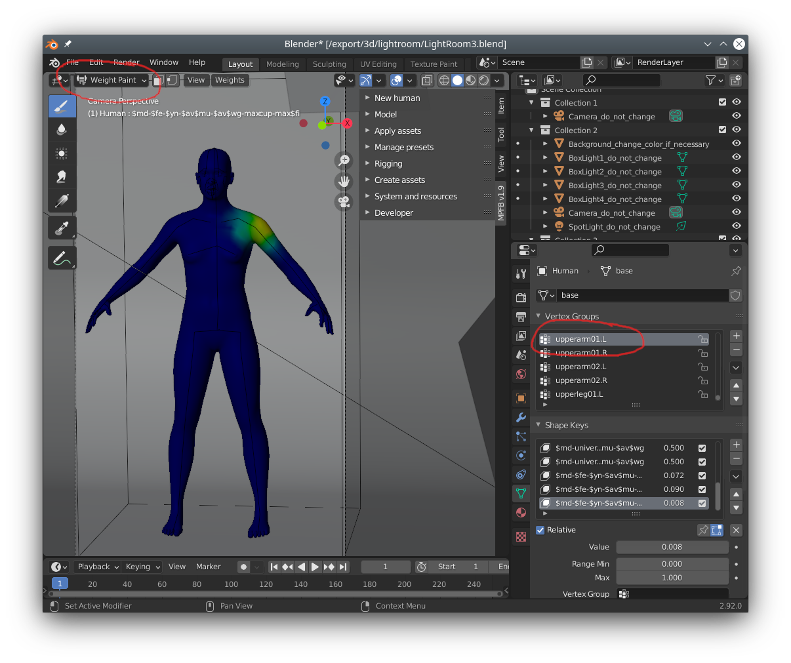
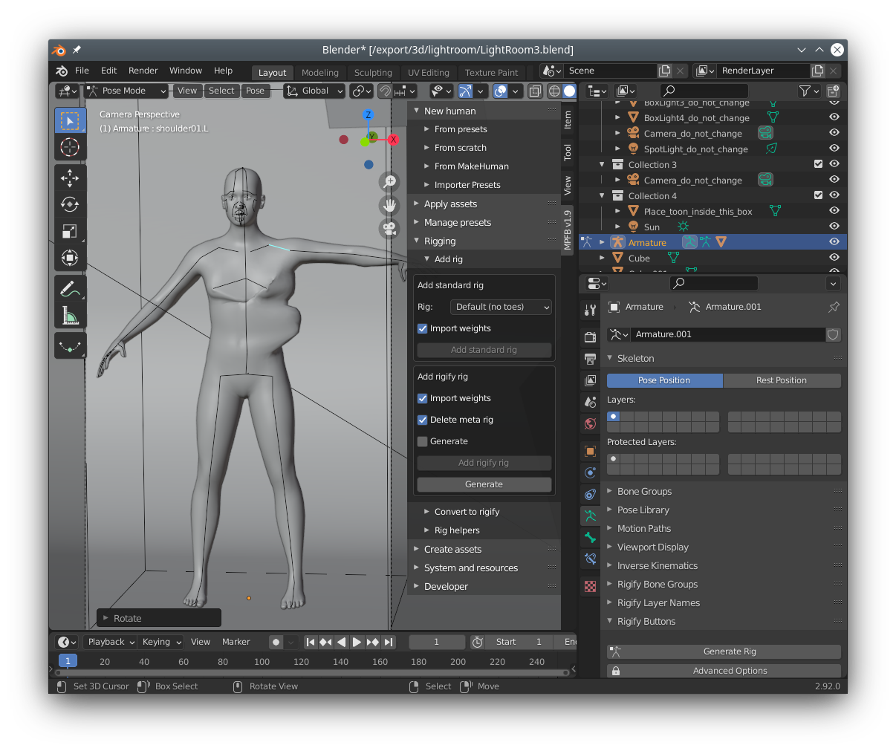

# Weight painting

These are instructions on how to contribute weight painting. 

- [What is weight painting and what problems are there with it?](#whatis)
- [Generating and contributing weights files for MPFB](#generating)
- [Examples of where weight painting help is needed](#help)

## What is weight painting and what problems are there with it?

In this context: weight painting controls how meshes deform during posing. There are other contexts where weight painting might be relevant, but in this text we're only 
discussing posing. 

When entering "weight paint mode", you can see which vertices are controlled by a bone, and by how much:

In this image we can see what area of the mesh will be modified when rotating the "upperarm01.L" bone. 

In weight painting mode, you can simply draw on the mesh to modify which vertices should be modified. A "warmer" color will mean influenced more and a "colder" less.

With proper weight painting, it should be possible to rotate a bone, and the mesh should deform in a logical manner:

However, if we did something wrong, the mesh will look strange. Here we have intentionally ruined the weight painting to demonstrate:

In reality, the effects are usually more subtle and might only be seen in extreme rotations or special cases.

## Generating and contributing weights files for MPFB

In MPFB, weight data is stored in JSON files. These are usually very large and hard to read, but as an example you can 
[take a look at the default rig's weights](https://raw.githubusercontent.com/makehumancommunity/mpfb2/master/src/mpfb/data/rigs/standard/weights.default.json)
in the git repository. 

There is one such file for each rig. When contributing weight painting, the goal is to generate a new version of the file.

The practical steps you would take would in summary be:

- Create a new human mesh "from scratch"
- Add the rig for which you want to improve weight painting
- Do the weight painting as weight painting is usually done (there are plenty of tutorials on youtube). How this is done is not specific for MPFB. However, there are a few convenience buttons on the "makeweight" panel.
- Verify the weight painting by moving around the bones in pose mode
- Verify that the weight painting also works for the "helper" geometry
- Use the save weights button on the "makeweight" panel to generate a JSON file
- Share the JSON file with the devs of MPFB, for example by making a pull request on github. Or if that seems too cumbersome, simply e-mail it.

## Examples of where weight painting help is needed

At the time of writing this (early summer 2021) the weight painting status for the various rigs is:

- "Default" and "Default no toes": Weight painting is mostly good and polished, although there might be some special cases where it could be improved
- "Game engine" and "CMU mb": Weight painting has been interpolated from the default rig and is mostly decent. It is not perfect though and needs to be updated.
- "Rigify": Weight painting for torso, arms and legs have been interpolated from the game engine rig and is functional but not good. Weight painting for the face has been auto-created by "automatic weights" and is outright bad and needs to be redone more or less from scratch.

For rigify, we can for example see that the helper geometry is not correctly weight painted:

When moving the jaw bone to open the mouth, the teeth do not follow. This is because 