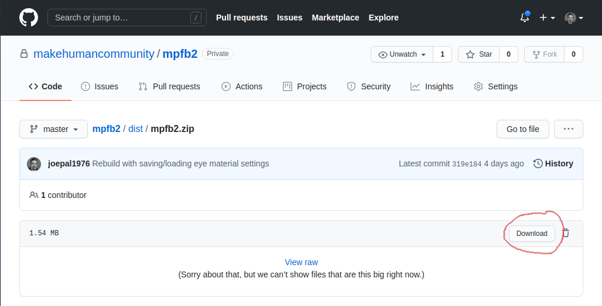

# Installing MPFB

MPFB is a Blender addon, so the [general instructions on how to install addons](https://docs.blender.org/manual/en/latest/editors/preferences/addons.html)
do apply. You might want to read these first in case you are unfamiliar with the procedure for installing Blender
addons.

## Downloading

MPFB comes as a zip file. At this point, the only source is the [latest build in the git repository](https://github.com/makehumancommunity/mpfb2/blob/master/dist/mpfb2.zip).
Later on, it is likely the zip will come bundled with new releases of makehuman.

You can download the zip by following the link above and clicking the "download" button.

