# Quick start

These are basic instructions for how to get up and running with MPFB2.

## Prerequisites

You will need Blender at least version 2.92 in order to run MPFB2. At this point it might make sense to go for the pre-builds of Blender 3.0.0.

You do not need MakeHuman in order to run MPFB2. However, if you want to integrate MakeHuman at some point, you will need at least version 1.2.0 of MakeHuman.

## Download

You can find the zip file with the addon in the [plugins directory on tuxfamily](https://download.tuxfamily.org/makehuman/plugins/). Look for the file
named "mpfb2-(some date).zip". 

In order to get the most out of MPFB2 you will also want to download some asset packs from the [asset packs page](https://download.tuxfamily.org/makehuman/asset_packs/index.html).
You will want at least the "makehuman system assets", which contains skins, eyes, teeth and similar. But you might as well download a few of the other asset packs too.

## Install MPFB2

MPFB2 is a Blender addon, so the [general instructions on how to install addons](https://docs.blender.org/manual/en/latest/editors/preferences/addons.html)
do apply. You might want to read these first in case you are unfamiliar with the procedure for installing Blender addons.

Basically, you need to go to edit -> preferences, find the "Add-ons" tab, click the "install..." button and find the zip file.

Note that since the zip file is pretty large, it might take a few seconds for Blender to load it before listing MPFB in the addons list:

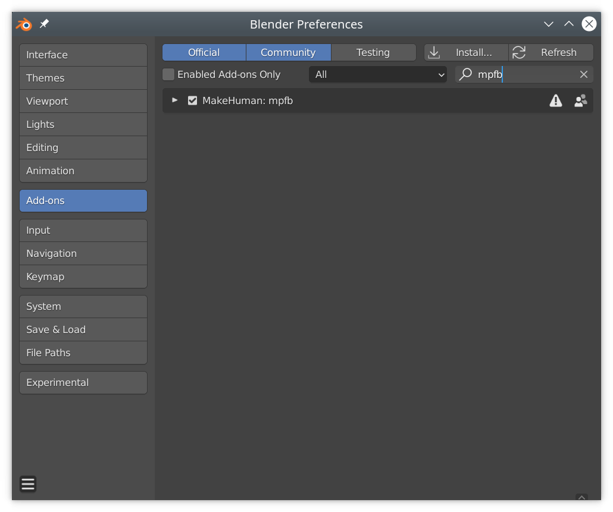

Check the checkbox for "MakeHuman: MPFB". Again, it might take a few seconds for blender to react.

If you have MakeHuman installed, you may want to check "auto-discover path to makehuman" and/or specifically provide a path in the "path to makehuman" box. These can be left empty if you do not want to use MakeHuman assets directly. 

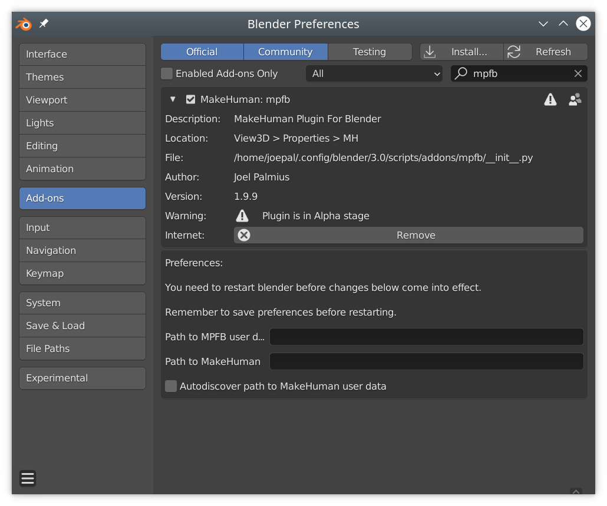

## Install assets packs

By now you should have a new tab "MPFB" on the "N" shelf in blender. If it is not visible, click the "n" key.

The first thing you should do is install the "makehuman system assets". You might as well also install any other asset packs you have downloaded.

Under "apply assets" -> "library settings" you will find a button "load pack from zip file":

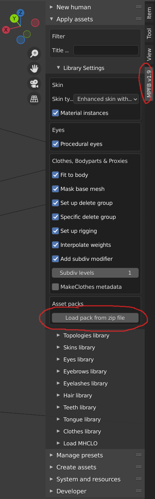

Click this button and browse to the addon zip file you downloaded.

Again, it might take a few seconds for blender to react.

Once you have installed the asset packs you downloaded, you should restart Blender.

## Create a human

You can now create a new human by going to "new human" -> "from scratch". 

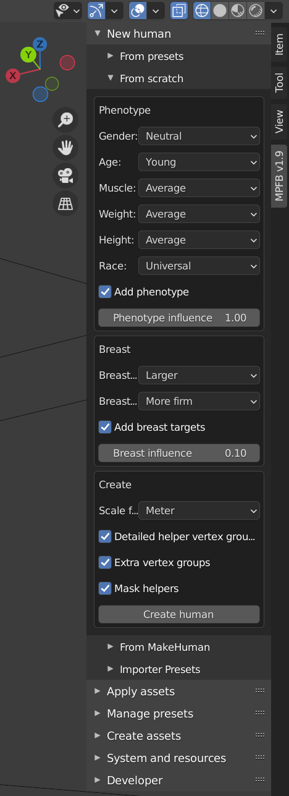

You can adjust the settings to your liking here. They are all possible to adjust later on, so this is just the rough starting point you want.

When having adjusted the settings, click "create human".

You should by now have gotten a human mesh without texture:

In order to better see what we're doing, add a skin by going to "apply assets" -> "skin library" and click "load" under a skin you like. 

You should now have a textured human:

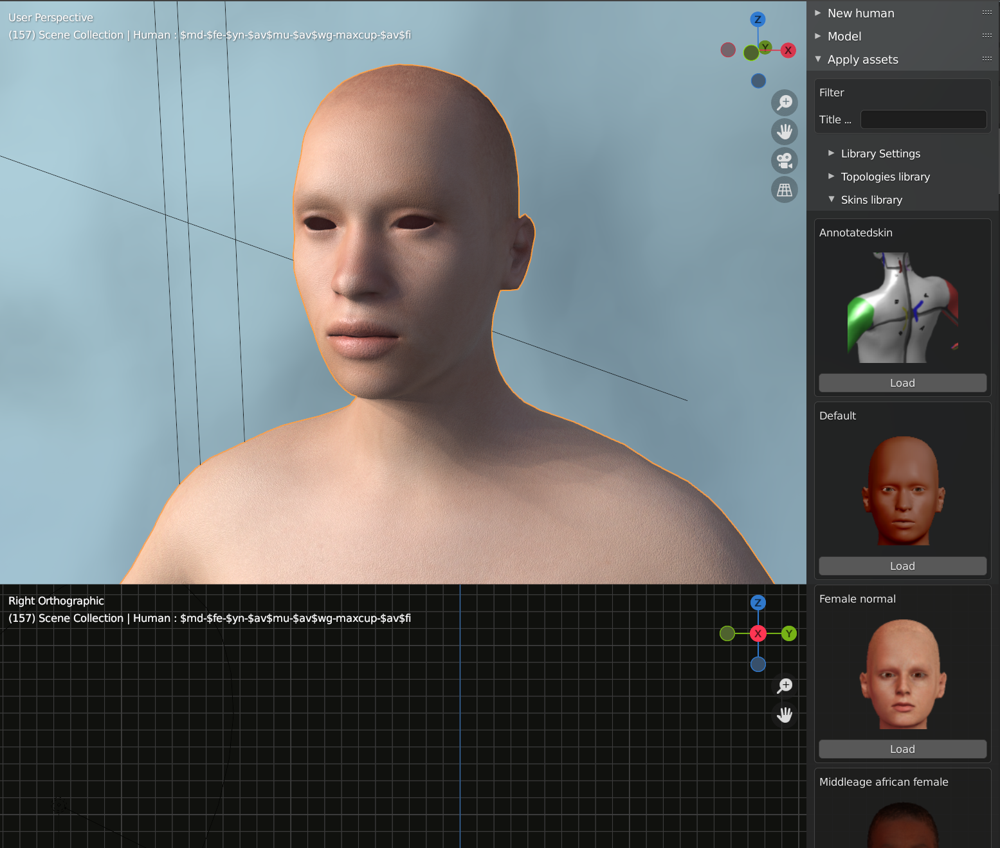

## Modeling

You can now start adjusting the shape of the human. With the human selected, you can go to the "model" panel and find various
subcategories, such as angle of the eyebrows:

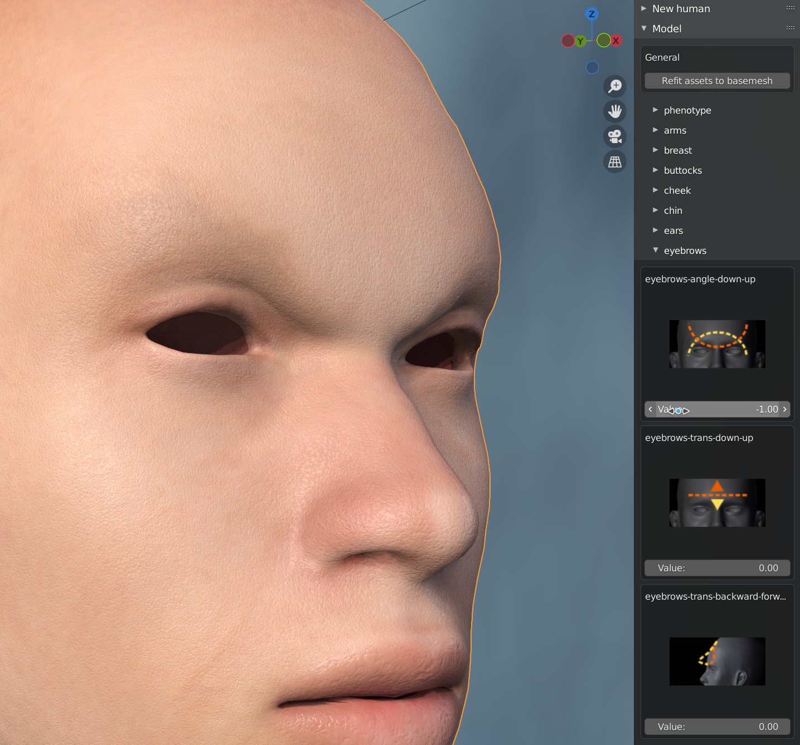

There are quite a lot of different sliders here, so just play around with them until you get a shape you like.

A good start is the "phenotype" category which contains macro shapes such as "weight" and "length". 

## Rigging

Before loading any clothes or body parts, we will want to have a rig. If you do not add a rig first, then the added assets will not be rigged.

To add a rig, go to "rigging" -> "add rig" and click "add standard rig". 

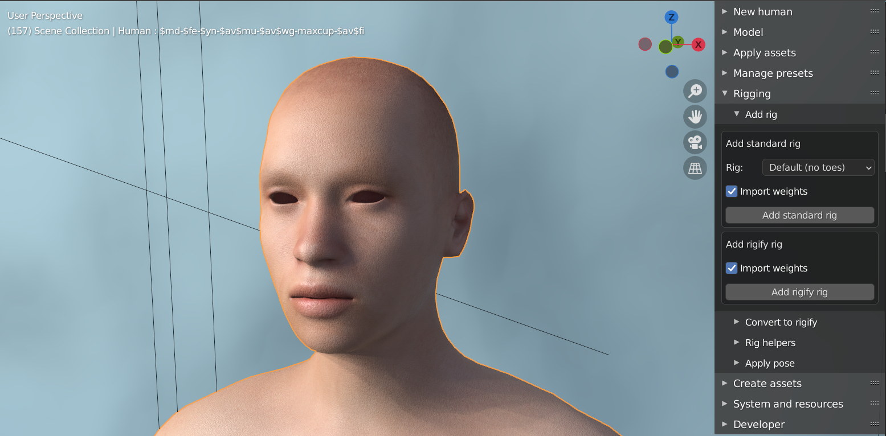

## Add hair, eyes and clothes

You can now go back to the "apply assets" panel and start loading assets. Under each category you should find at least a few sample assets. More if you 
downloaded several asset packs. 

You will want to add at least eyes, eyebrows, eyelashes, hair and some clothes.

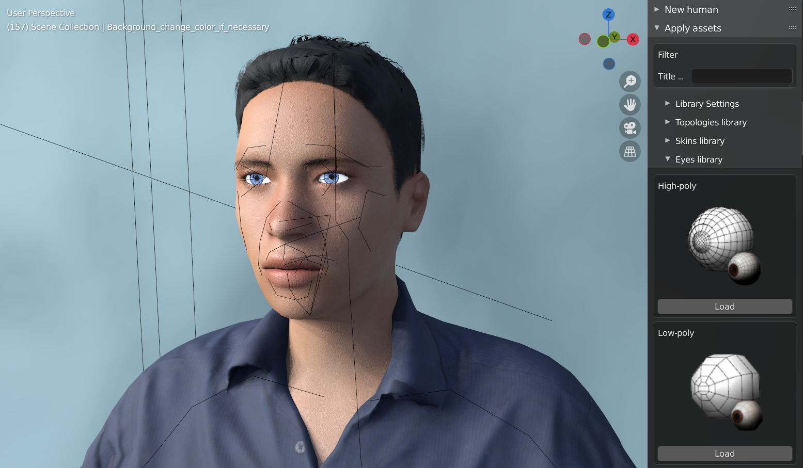

## Enable IK

You intend to do posing, it might be helpful to enable IK helpers. 

With the rig selected, go to "rigging" -> "rig helpers" and click "add helpers". Note that this is only available if you use the "default" or "default no toes" rigs. 

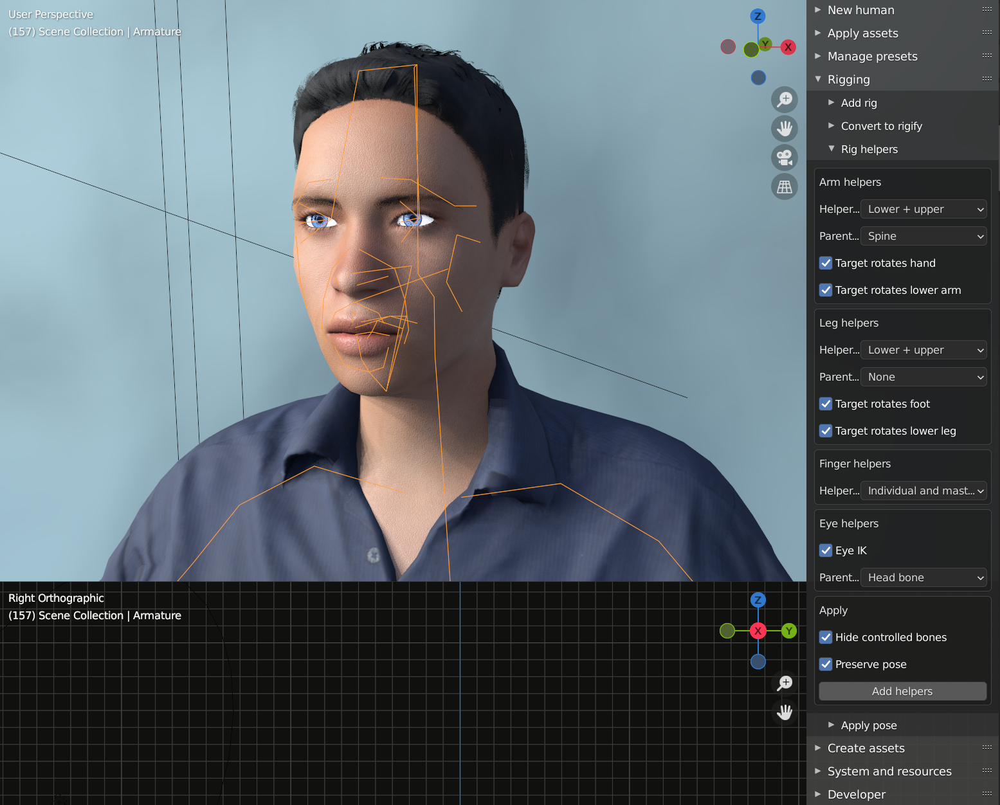

Having done so, you will get for example hand helpers:

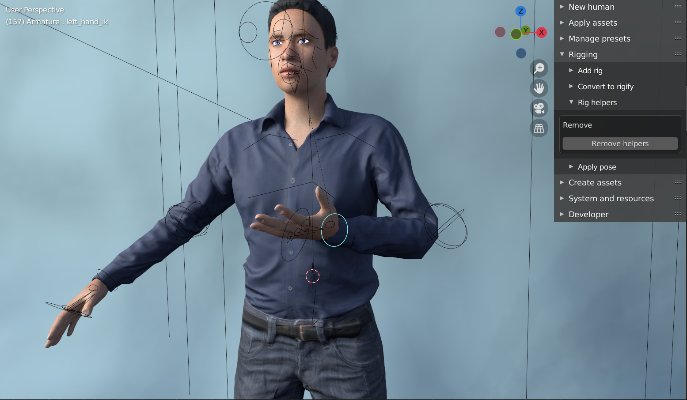

## Detailed adjustment of the skin

You can tweak the procedural aspects of the skin by selecting the body and going to the materials panel:

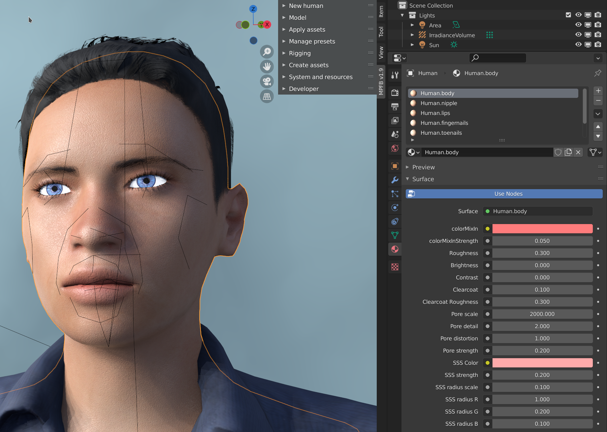

You can adjust the settings for different parts of the body separately.

## Detailed adjustment of the eyes

In the same way you can tweak the procedural aspects of the eyes by selecting the eyes and going to the materials panel:

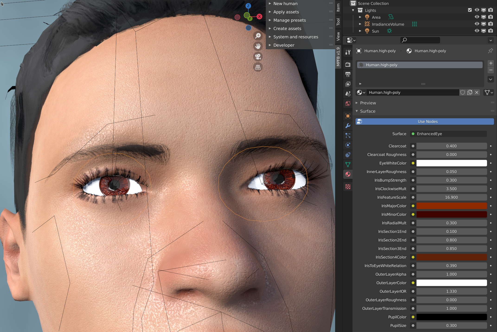

## Storing your character settings for later re-use

Once you are happy with your character, you can store it as a preset for future use.

Go to the "manage presets" -> "human presets" panel and enter a new name for your character in the "presets name" box.

When you want to create a new character based on the stored presets, go to the "new human" -> "from presets" panel and select it in the drop down:

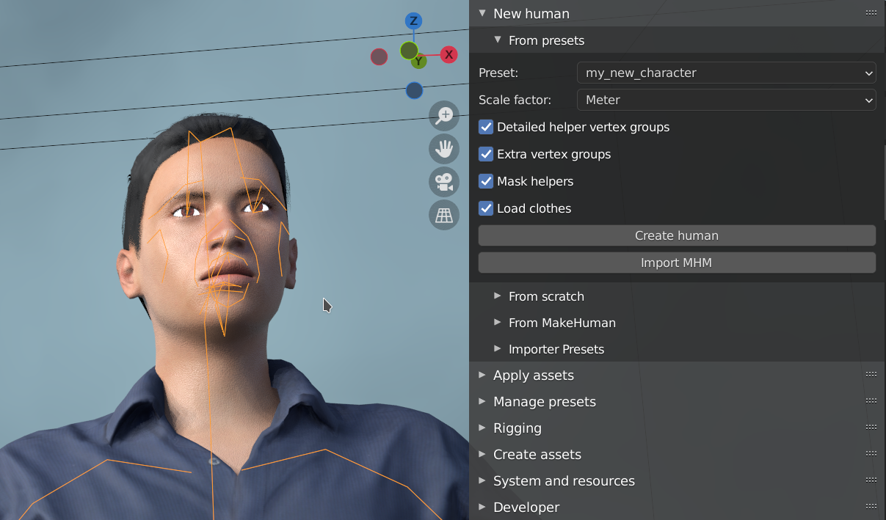

