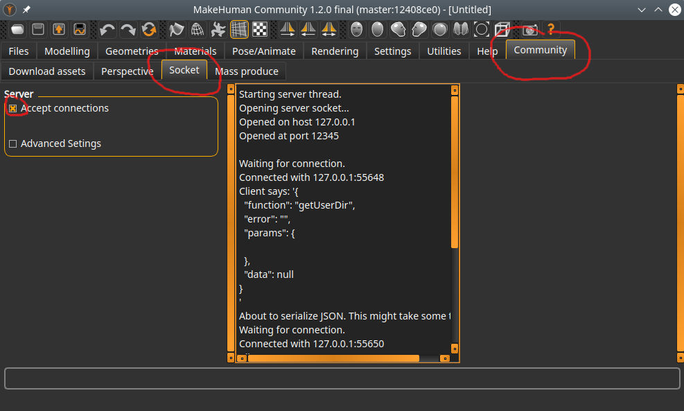
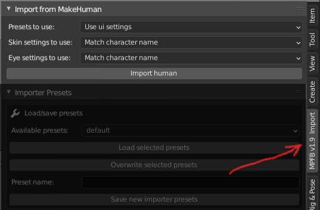

# Importing from MakeHuman

These are general instructions on how to import a model from MakeHuman.

## Requirements and preparations

You need at least MakeHuman Community 1.2.0 for this to work. MakeHuman must be running. 

In order to do direct imports from MakeHuman, you must enable the "socket server" inside MakeHuman. This is disabled
per default. 

In MakeHuman, find the "Community" -> "Socket" tab.

Check the "Accept connections" checkbox. The center column should indicate that the server socket is started.

You can change the port that the server socket listens on (under "advanced"), but it is unlikely that you want to do so. 

## Basic operation

The UI for importing from MakeHuman is located on the "N" shelf in Blender. 

If all you want to do is to import with defaults, simply click the "Import human" button.

## Import options

On the import panel you can specify that you want to use particular settings / overrides.

- **Presets to use**: These are settings for how the import should be done, for example if clothes should be imported or not. What these presets are and how to create them is described on the [importer presets](presets.md) page. If you select "use ui settings" here, the importer will use what is set on the "importer presets" panel directly below the "import from makehuman" panel.
- **Skin settings to use**: If you have specified (in the presets) that you want to use the enhanced skin material, you can here choose which particular skin settings you want to use. The enhanced skin is described on the [enhanced skin](../material/enhanced_skin.md) page. How to create sets of settings for skin is described on [enhanced skin settings](../material/enhanced_skin_settings.md) page.
- **Eye settings to use**: If you have specified (in the presets) that you want to use the procedural eye material, you can here choose which particular eye settings you want to use. The procedural eye material is described on the [procedural eyes](../material/procedural_eyes.md) page. How to create sets of settings for eyes is described on [procedural eyes settings](../material/procedural_eyes_settings.md) page.
