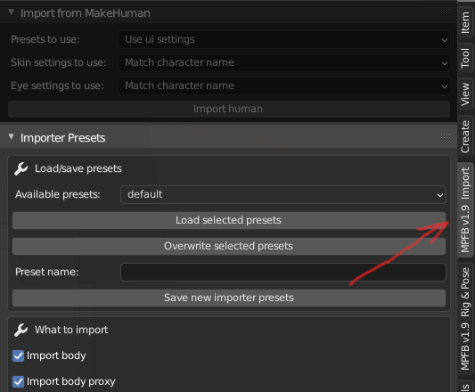

# Importer presets

This page describes the options available for controlling the import process, as well as how to save set of these options as presets.

You can find the importer presets on the "import" tab of the "N" shelf in Blender.

## Saving/loading presets

Normally, you will want to establish a pipeline that works for you and then save that as presets that can be used in the import. 

If you save presets here, they will also appear in the "Presets to use" drop-down on the import tab. 

