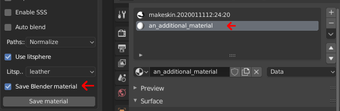

# blendMaterial

* __Data type:__ filename + material reference (see example) 
* __What is it for:__ attaching a full blender material in a separate .blend file
* __Use when:__ the material setup supported by MHMAT isn't enough 
* __Implemented in MakeSkin:__ yes (there is a checkbox in the main panel)
* __Makes visible difference in blender:__ yes
* __Makes visible difference in makehuman:__ no

If you want, you can also save an entire material as an attachment to the MHMAT file. This will
be stored in a .blend file saved alongside the MHMAT file. This can be useful if you, for example,
want to use procedural texturing. 

The material is read from the second material slot in the selected object. So if you want to save
the primary node setup, you will have to reference it in the second slot too.

The secondary material will obviously not show up in MakeHuman.

## Example

This specifies that there is a separate material "an_additional_material" in a file called "my_cool_material.mat.blend".

    blendMaterial my_cool_material.mat.blend/materials/an_additional_material 

You need a second material slot and to check the save blender material checkbox, in order to save a material as an attachment:

