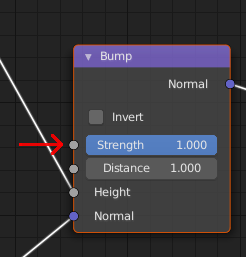

# bumpmapIntensity

* __Data type:__ float in range 0.0 to 1.0
* __What is it for:__ Influencing the strength of a bumpmap
* __Use when:__ You don't want a more subtle bumpmap than one applied at 100%
* __Implemented in MakeSkin:__ yes (it is read from the "Strength" setting, see below)
* __Makes visible difference in blender:__ yes
* __Makes visible difference in makehuman:__ no (since bumpmaps aren't implemented)

If you don't want the full effect of a bumpmap, you can opt to apply it with a smaller effect.
This is equal of having a lower "height" for the maximum colors. 

## Example

To apply the bumpmap at 50%:

    bumpmapIntensity 0.5

## In blender

The setting for bumpmapIntensity is read from the bump node's "Strength" value:

