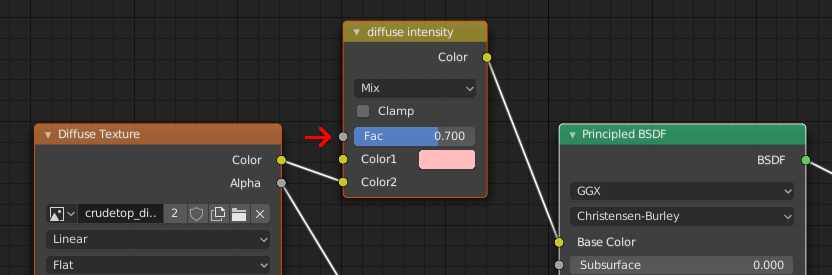

# diffuseIntensity

* __Data type:__ float in range 0.0 to 1.0
* __What is it for:__ Controling the influence of the diffuseTexture
* __Use when:__ You want to mix the diffuse texture with the diffuse color
* __Implemented in MakeSkin:__ yes
* __Makes visible difference in blender:__ yes
* __Makes visible difference in makehuman:__ no (unless you use the "toon" shader)

You can opt to not apply the [diffuseTexture](diffuseTexture.md) at 100% (1.0). If you, for example, want
the [diffuseColor](diffuseColor.md) to have a 50% influence on the resulting diffuse color, you can set diffuseIntensity
to 0.5. This is ignored in almost all shaders in makehuman, where you either have a diffuseColor 
*or* a diffuseTexture. 

If set to 1.0 (which is the default if not specified), this key will be excluded from the
resulting MHMAT file when exporting from MakeSkin.

## Example

Mix diffuseColor and diffuseTexture equally:

    diffuseIntensity 0.5

## In blender

The diffuseIntensity setting is read from the Fac socket of the MixRGB node between the diffuse texture 
and the principled node:

