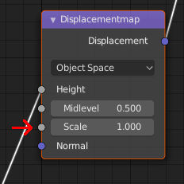

# displacementmapIntensity

* __Data type:__ float in range 0.0 to 1.0
* __What is it for:__ Influencing the strength (scale) of a displacementmap
* __Use when:__ You don't want a more subtle displacementmap than one applied at 100%
* __Implemented in MakeSkin:__ yes (it is read from the "Strength" setting, see below)
* __Makes visible difference in blender:__ yes
* __Makes visible difference in makehuman:__ no (since displacementmaps aren't implemented)

If you don't want the full effect of a displacementmap, you can opt to apply it with a smaller effect.
This is equal of having a smaller "scale" for the maximum colors. 

Note that since displacement maps do not have a "Strength" attribute, this setting influences the 
"Scale" attribute, which is how far out a the color white will shift a point on the surface.

## Example

To apply the displacementmap at 0.5 units for white:

    displacementmapIntensity 0.5

## In blender

The setting for displacementmapIntensity is read from the displacement node's "Scale" value:

