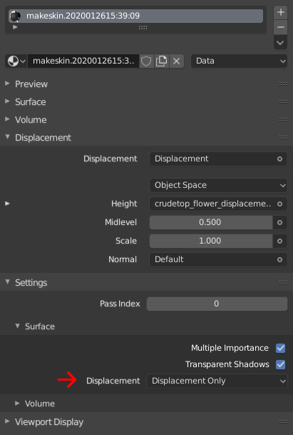

# displacementmapTexture

* __Data type:__ filename
* __What is it for:__ Adding "real" displacement to an object
* __Use when:__ bumpmaps or normalmaps aren't enough
* __Implemented in MakeSkin:__ yes
* __Makes visible difference in blender:__ yes (but you might have to tweak the displacment settings)
* __Makes visible difference in makehuman:__ no

By using displacement you can actually shift points on the surface in 3d space, as opposed to to bumpmaps and normalmaps
which only adds shadows to emulate shifted points. 

This is a computation intensive thing to do, and much of the time you're perfectly fine using bump or normal. However, in
a subset of cases, it will be necessary to do actual displacement. 

In practise, the displacementmap looks and works exactly as a bumpmap: White is up and black is down. 

Note that combining real displacement with normal or bump maps might produce strange side effects in blender. 

## Example

    displacementmapTexture mycharacter_displace.png

## Choosing form of displacement

The default in blender is to treat the displacement in exactly the same way as a bump map. If you want "real" displacement,
you will have to choose what form, in a separate setting:

