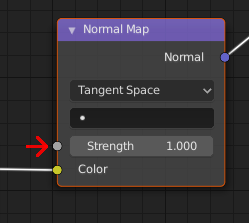

# normalmapIntensity

* __Data type:__ float in range 0.0 to 1.0
* __What is it for:__ Influencing the strength of a normalmap
* __Use when:__ You don't want a more subtle normalmap than one applied at 100%
* __Implemented in MakeSkin:__ yes (it is read from the "Strength" setting, see below)
* __Makes visible difference in blender:__ yes
* __Makes visible difference in makehuman:__ yes

If you don't want the full effect of a normalmap, you can opt to apply it with a smaller effect.
This will cause emulated valleys to become more shallow, and emulated peaks lower. 

## Example

To apply the normalmap at 50%:

    normalmapIntensity 0.5

## In blender

The setting for normalmapIntensity is read from the normalmap node's "Strength" value:

